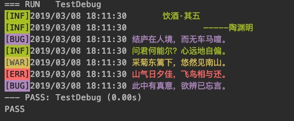

# colorlog彩色日志
> 带有颜色的日志, 分四个等级, debug < info < warning < error


# 基本应用
```
colorlog.Info("      饮酒·其五     ")
colorlog.Info("              -----%s", "陶渊明")
colorlog.Debug("结庐在人境，而无车马喧。")
colorlog.Info("问君何能尔？心远地自偏。")
colorlog.Warning("采菊东篱下，悠然见南山。")
colorlog.Error("山气日夕佳，飞鸟相与还。")
colorlog.Debug("此中有真意，欲辨已忘言。")
```

## 输出效果


# 自定义扩展彩色日志

## 输出到buffer里
```
//把结果输入到buffer里
buff := new(bytes.Buffer)
lg := logcolor.New(buff, true)
lg.Warning("人间正道是沧桑")
//输出结果
fmt.Print(buff.String())
```

## 写入文件中
```
file := "./color_log.txt"
f, err := os.OpenFile(file, os.O_CREATE|os.O_WRONLY|os.O_APPEND, 0666)
if err != nil {
    panic(err)
}
buff := new(bytes.Buffer)
lg := logcolor.New(buff, true)
lg.Warning("人间正道是沧桑")
//输出结果
n, err := f.Write(buff.Bytes())
if err != nil {
    panic(err)
}
fmt.Println("写入字节: ", n)
```

## 自定义等级

```
lg := logcolor.New(os.Stdout, true)
lg.SetLevel(INFO)
lg.Info("人生如逆旅，我亦是行人-------------%s", "出自宋代苏轼")
lg.Debug("输不出来的")
lg.SetLevel(DEBUG)
lg.Debug("我胡汉三又回来了")
```

## 基准测试
```
BenchmarkDebug-4          500000              2303 ns/op             315 B/op          3 allocs/op
BenchmarkInfo-4          1000000              2157 ns/op             313 B/op          3 allocs/op
BenchmarkWarning-4       1000000              2181 ns/op             319 B/op          3 allocs/op
BenchmarkError-4         1000000              2408 ns/op             311 B/op          3 allocs/op
```